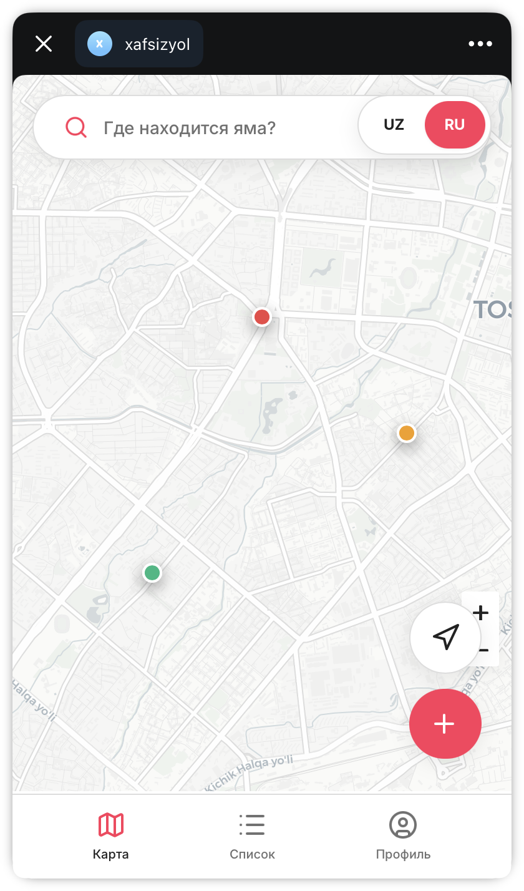
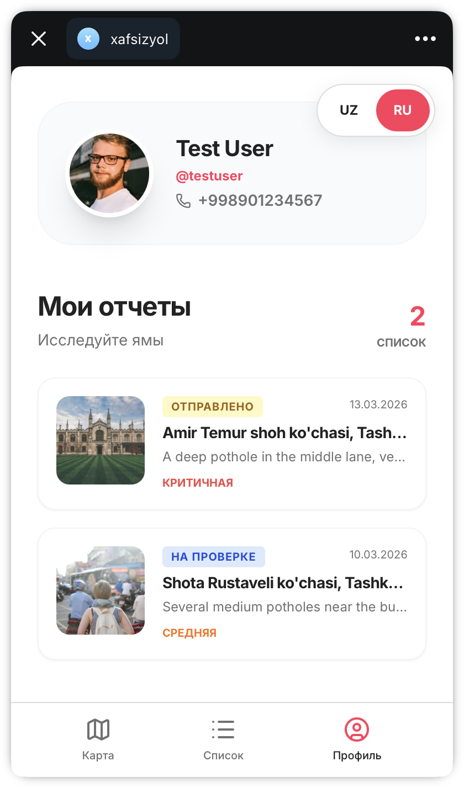
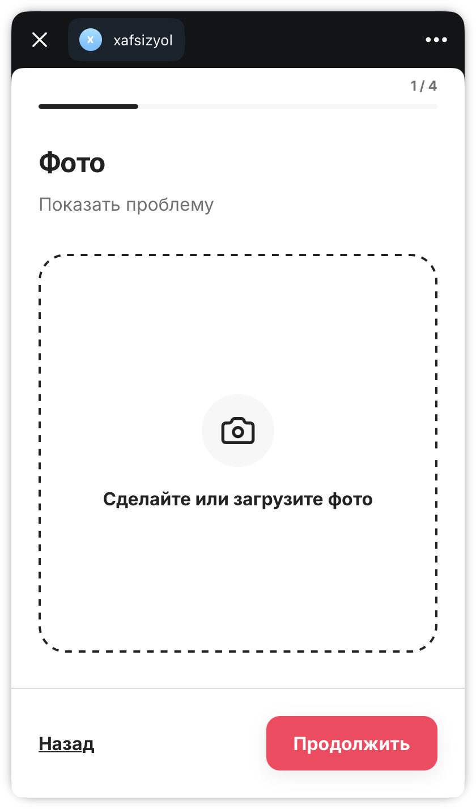
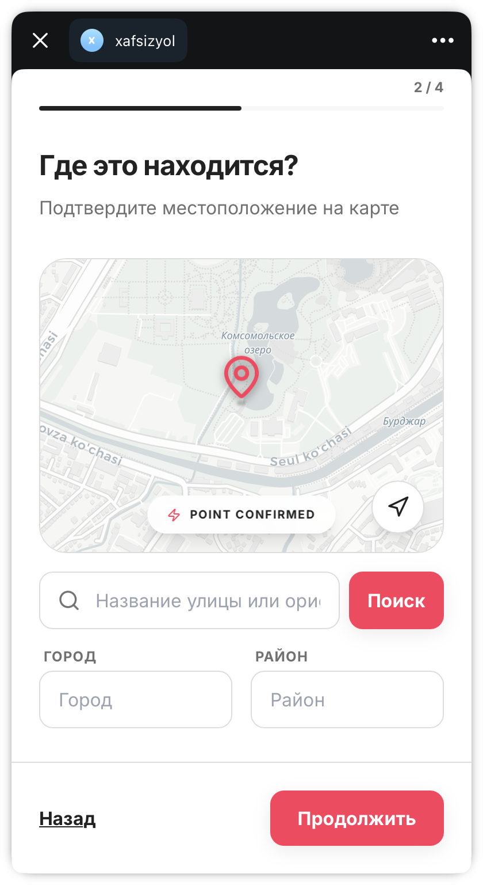
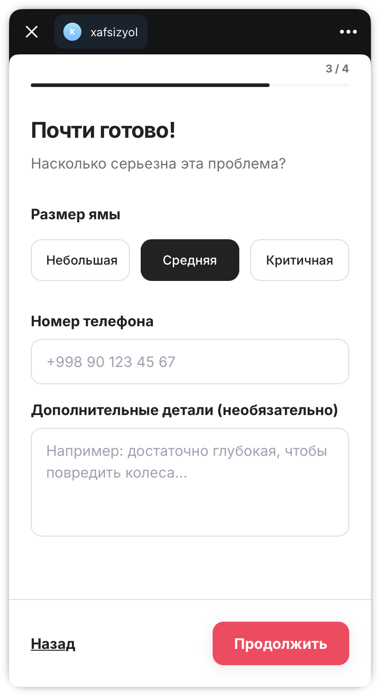
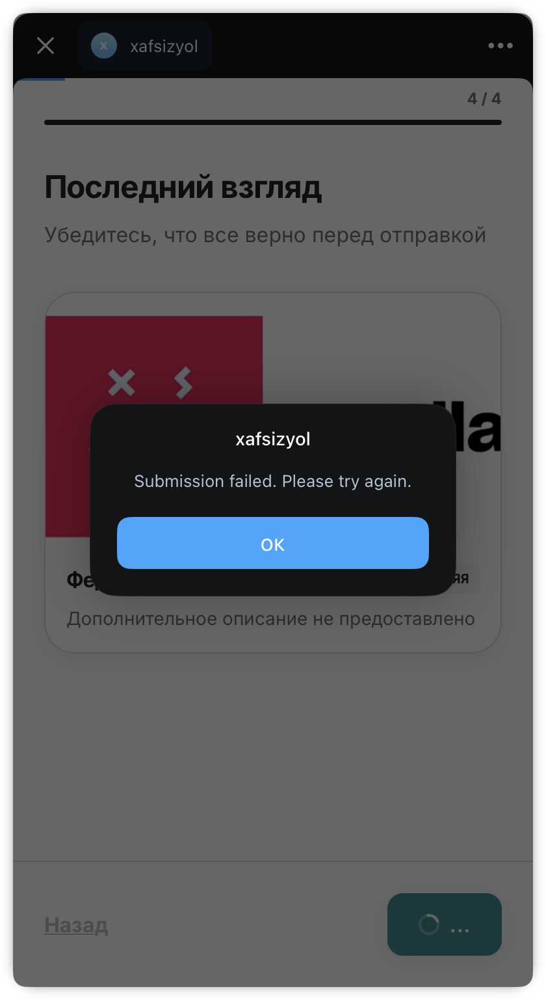

# 🛣️ Xafsizyol (Safe Road)

**Xafsizyol** is a modern, community-driven platform designed to improve road safety and infrastructure maintenance in Uzbekistan. By allowing citizens to report road hazards like potholes, cracks, and obstructions in real-time, we bridge the gap between the public and local authorities.

---

## ✨ Project Showcase

| Interactive Map View | Pothole Discovery | User Profile & Reports |
|:---:|:---:|:---:|
|  |  |  |

### 🛠️ Reporting Flow
Easily report a hazard in 4 simple steps:

| Step 1: Photo | Step 2: Location | Step 3: Details | Step 4: Review |
|:---:|:---:|:---:|:---:|
|  |  |  |  |

---

## 🚀 Key Features

- **📍 Real-time Hazard Tracking:** View and report road issues on an interactive map.
- **📸 Categorized Reporting:** Upload photos and provide descriptions of specific hazards.
- **📱 Mobile Interaction:** Fully responsive design optimized for reporting on the go.
- **🌍 Multilingual Support:** Comprehensive support for Uzbek (UZ), Russian (RU), and English (EN).
- **📊 Status Updates:** Track the progress of your reports from "Submitted" to "Fixed".
- **💳 Integrated Payments:** (Future) Support for road-related fines or infrastructure funding.

---

## 🛠️ Tech Stack

- **Frontend:** [Nuxt.js](https://nuxt.com/) (Vue 3)
- **Styling:** [TailwindCSS](https://tailwindcss.com/)
- **Maps:** [Leaflet.js](https://leafletjs.com/)
- **State Management:** [Pinia](https://pinia.vuejs.org/)
- **Backend:** Nuxt Server Engine (Nitro)

---

## 📚 Project Documentation

For a deeper dive into the technical and strategic aspects of the project, please refer to the following documents:

- 📄 [Project Proposal](docs/proposal.md) - Problem statement and solution overview.
- 🏗️ [Architectural Design](docs/architecture.md) - Detailed system architecture and data flow.
- 🗺️ [C4 Diagrams](docs/c4-diagrams.md) - System Context, Container, and Component diagrams.
- 🤝 [Team Charter](team_charter.md) - Team roles, goals, and working agreements.

---

## 💻 Setup & Development

### 1. Installation
```bash
npm install
```

### 2. Development
Start the development server on `http://localhost:3000`:
```bash
npm run dev
```

### 3. Production
Build and preview the production application:
```bash
npm run build
npm run preview
```

---

## 🎓 Academic Requirements (GitHub)
This repository follows the academic requirements set for project tracking:
- **Project Board:** Active Kanban board with To-Do, In Progress, Review, and Done columns.
- **Issue Tracking:** 15+ tracked issues with labels and acceptance criteria.
- **Pull Requests:** Minimum 5 merged PRs demonstrating peer review.
- **Documentation:** Full suite of docs in the `docs/` folder.

---
Developed with ❤️ by **Sarvar** for the Safe Road Initiative.
