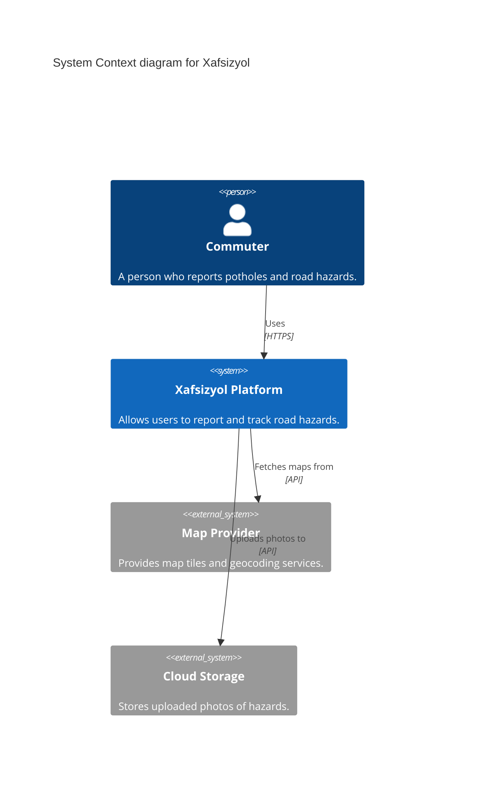
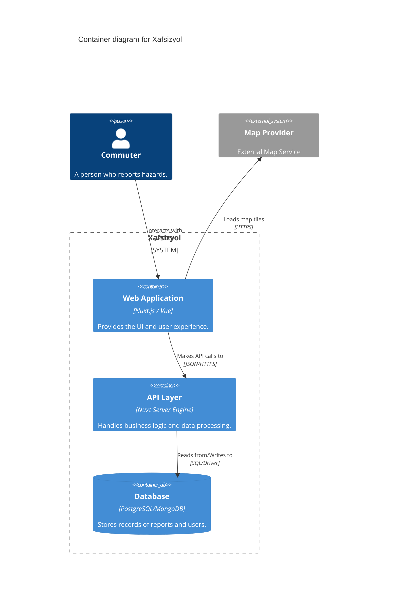
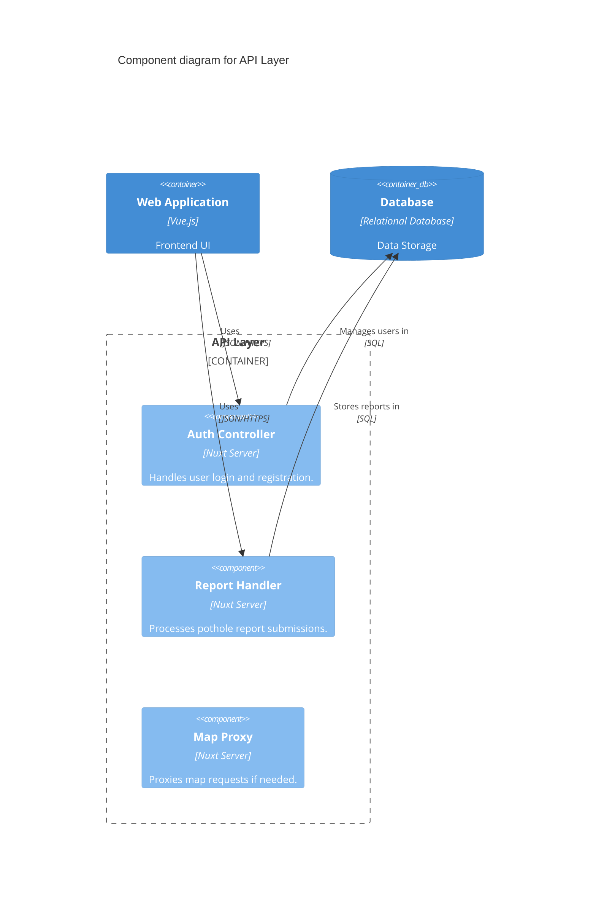

# C4 Diagrams: Xafsizyol

## Level 1: System Context Diagram
Shows how the Xafsizyol system interacts with users and external systems.

## Level 2: Container Diagram
Shows the high-level technical building blocks of the system.

## Level 3: Component Diagram (API Layer)
Shows the internal components of the API Layer.

